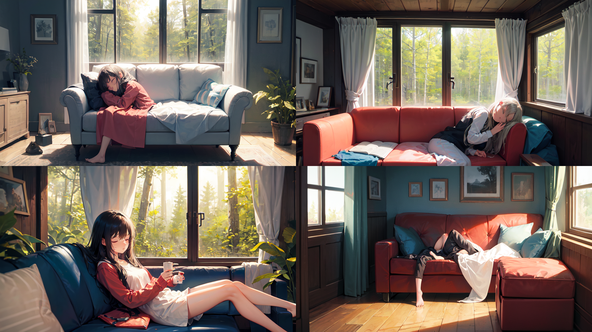
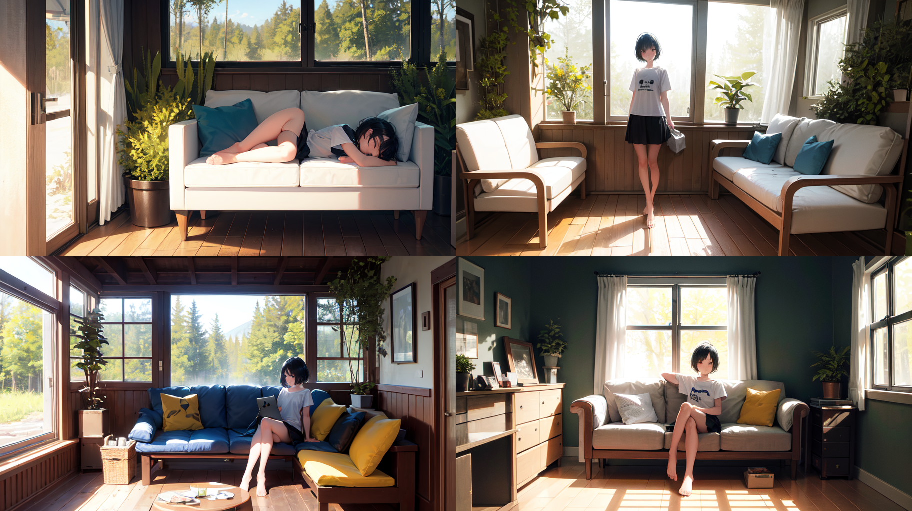
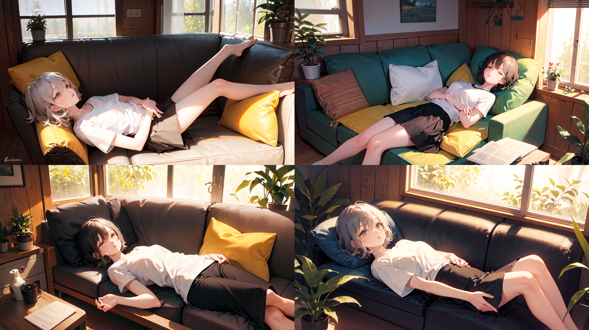
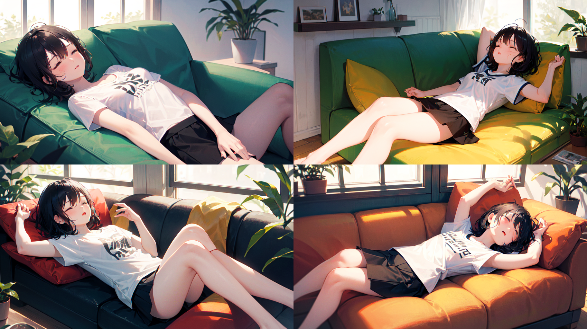

# 通用tag的写作手法
我们可以思考一个大概的画面，然后通过 **广义三段式** 的思想来丰富场景的内容。

通过对一个主体进行 **三段式** 拆分，然后将每个小短句拆分到整个tags中，利用多次描述的强化叠加效果来强化主体的表现。
同时因为对主体的完整描述进行了拆分，这个方法可以把几个颜色组隔离到几个段落中，从而减少污染。

最后再根据需求，使用 **分步渲染** 等进阶技术，来调整部分语句的内容或者顺序，使画面更接近所需要的情况。

## 练习1：一个女孩在木屋的沙发上睡觉，窗外是森林
使用模型：cetusMix_v2

注意事项：
<ul>
  <li>detailed boby是瑟词</li>
  <li></li>
</ul>

先按 **基本三段式** 进行书写：前缀 + 主体 + 场景

正面tag：masterpiece, an extremely delicate and beautiful girl, 1girl is sleeping on the sofa in the cabin, and outside the window is a forest

负面tag：(worst quality:1.4),(low quality:1.4),(extra digits:1.4),(bad face:1.4)

使用 **广义三段式** 扩充细节：

一个女孩在木屋的沙发上睡觉，窗外是森林。
<ins>女孩有着干净的短发和灰色的眼睛，她穿着白色的T恤和黑色的短裙。</ins>
<em>木屋的中间有黄色的布质沙发。左边的地上摆放着一些盆装植物。右边是窗户，窗外是树林，阳光透过窗户照进屋内。</em>

A girl is sleeping on the sofa in the cabin, and outside the window is a forest.
<ins>The girl has clean short hair and gray eyes, and she is wearing a white T-shirt and a black short skirt.</ins>
<em>There is a yellow fabric sofa in the middle of the cabin. Some potted plants are placed on the ground on the left. On the right is a window, outside of which is a forest, and the sunlight shines into the house through the window.</em>

直接将上述英文并入正向tag进行算图：

甚至变得更糟糕了，因为模型处理长句的能力是有限的。转换为tag + 短强句：

正面tag：

masterpiece, an extremely delicate and beautiful girl, 

1girl, solo, the girl is sleeping on the sofa, on back, in a cabin,
short hair, grey eyes, white t-shirt, black skirt,
yellow fabric sofa in the cabin, potted plants on the ground, sunlight through the window, outside of the windows is forest,

负面tag：(worst quality:1.4),(low quality:1.4),(extra digits:1.4),(bad face:1.4)

能明显地看出有了很大的提升。但我们也能发现，模型很容易把颜色混淆——头发、衣服、裙子、沙发的颜色自由组合。试着用 **分段符** 和 **分步渲染** 的技巧处理容易出错的细节，如颜色、手脚。

正面tag：

((masterpiece)), ((an extremely delicate and beautiful)),

1girl is sleeping  on the sofa, (on back:1.4), in a cabin, solo,
(the girl has a [+++detailed cute face+++]:1.1), (closing eyes:1.2), (short black hair:1.2), [[:✋,:0.5]::0.8], 
ai si sb, (the girl has a white t-shirt and black short skirt:1.4) ,ai is sb, potted plants on the ground, sunlight through the window, outside of the windows is forest, (the girl is lying on sofa:1.4)

负面tag：
(worst quality:1.4),(low quality:1.4),(extra digits:1.4),(three legs:1.4), (bad legs:1.4), bad face,  (bad hands:1.4), watermark, signature, 

从生成的多组图片来看，头发和衣服颜色出错的概率大幅降低了，但”躺“的姿态还是很难画好，尤其是躺在沙发这样一个不那么宽敞的地方，肢体很容易不协调或是多手多腿。

