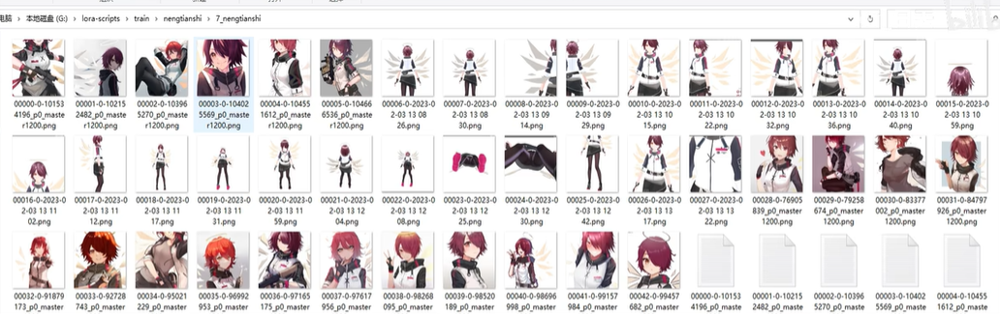
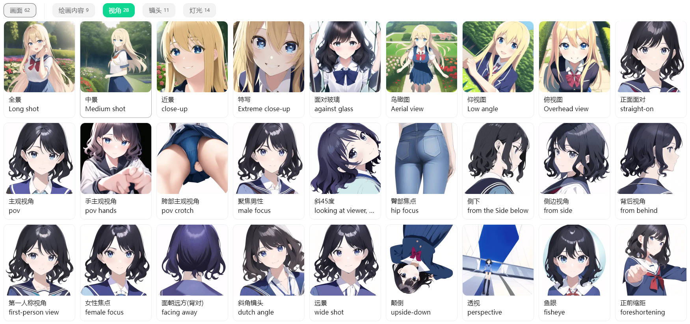
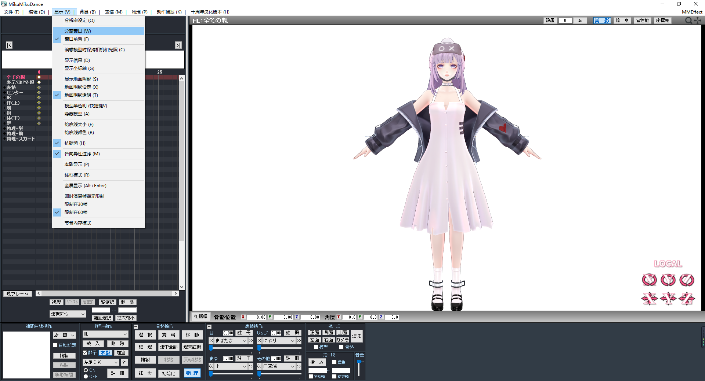

# 人物LORA模型的训练_海拉
想要炼制一个好的人物LORA模型，最重要的是训练集的构建，下面是一个不错的训练集：

我们可以从中发现有这么些要求：
<ul>
  <li>不一定要投喂原本游戏中的立绘，各种风格的同人图也可以</li>
  <li>相机多角度，鞋底也不要错过（当然如果没有MMD模型的话，很难做到这一点）</li>
  <li>角色多表情，多姿势</li>
</ul>

SD中有许多与构图视角相关的tag，在标注的时候，这些tag会被用于描述图片：

我们可以根据这些tag，以及MMD面板中的按钮，进行一些维度上的组合来选图：
<ul>
  <li>相机中心：Y5（小腿），Y10（腰），Y15（颈），Y17（脸）</li>
  <li>视点：正面，背面（角度Y180），上面（角度X90），下面（角度X-90），左面（Y90），右面（Y-90）</li>
  <li>角度：X±15，X±30，X±45，Y±15，Y±30，Y±45</li>
  <li>距离：45，30，15</li>
</ul>
如，相机中心Y15 + 视点正面 + 距离15。

操作方法：
<ul>
  <li>进入到“模型编”，取消选定“物理”</li>
  <li>进入到“相机编”，操作“相机中心Y”，“角度XY”，“距离”，“视点”</li>
  <li>进入到“模型编”，取消选定“选取”</li>
  <li>进行截图</li>
</ul>

可选——选择分离窗口，这样我们可以进行窗口截图，方面后续进行统一裁剪成768×768：

